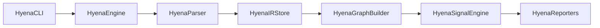

# Hyena

Hyena is a static analysis engine for Swift codebases that parses source code into an Intermediate Representation (IR), constructs dependency graphs, and performs various architectural analyses.

## Features

- **Swift Parsing** - Parses Swift source files using SwiftSyntax
- **IR Generation** - Converts code into a rich intermediate representation
- **Dependency Graphs** - File dependency, inheritance, and call graphs
- **Code Signals** - Detects architectural issues and code smells
- **Multiple Export Formats** - JSON, DOT (Graphviz), and Mermaid

## Installation

```bash
git clone https://github.com/Chandram-Dutta/Hyena.git
cd Hyena
swift build -c release
```

## Usage

```bash
# Basic scan
hyena scan /path/to/swift/project

# Export as JSON
hyena scan /path/to/project --export json --output analysis.json

# Export as Mermaid diagram
hyena scan /path/to/project --export mermaid --output graph.md

# Export as DOT (Graphviz)
hyena scan /path/to/project --export dot --output graph.dot
```

## Architecture



### Modules

| Module | Description |
|--------|-------------|
| **HyenaCLI** | Command-line interface using ArgumentParser |
| **HyenaEngine** | Orchestrates the analysis pipeline |
| **HyenaParser** | Parses Swift code using SwiftSyntax |
| **HyenaIRStore** | Stores intermediate representation (files, symbols, relations, types, functions, call sites) |
| **HyenaGraphBuilder** | Builds file dependency, inheritance, and call graphs |
| **HyenaSignalEngine** | Detects code signals and architectural issues |
| **HyenaReporters** | Exports results in JSON, DOT, and Mermaid formats |

## Graphs

Hyena builds three types of graphs:

- **File Dependency Graph** - Shows import relationships between files
- **Inheritance Graph** - Shows class/protocol inheritance and conformance
- **Call Graph** - Shows function call relationships

## Signals

Hyena detects the following code signals:

| Signal | Severity | Description |
|--------|----------|-------------|
| `dead-file` | Warning/Info | Files not imported or referenced |
| `circular-dependency` | Error | Circular import dependencies |
| `blast-radius` | Warning/Error | Files with many transitive dependents |
| `central-file` | Warning/Error | Files imported by many others |
| `god-file` | Warning/Error | Files that import too many modules |
| `deep-chain` | Warning/Error | Deep dependency chains |
| `deep-hierarchy` | Warning/Error | Deep inheritance hierarchies |
| `wide-protocol` | Warning/Error | Protocols with many conformers |
| `hot-function` | Warning/Error | Functions called frequently |
| `unused-function` | Info | Functions never called internally |
| `high-instability` | Warning/Info | Highly unstable files (Martin metrics) |
| `low-abstractness` | Info | Concrete files with many dependents |
| `distance-from-main-sequence` | Warning/Info | Files in zone of pain/uselessness |

## Requirements

- macOS 13+
- Swift 6.2+

## License

MIT
