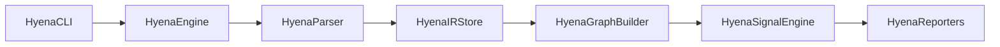

# Hyena

Hyena is a static analysis engine for Swift(more in future) codebases that parses and converts swift code into an Intermediate Representation (IR) format. It is then able to construct dependency graphs and perform various analyses on the code.

### Architecture

- HyenaCLI - Responsible for parsing command line arguments and invoking the engine.
- HyenaEngine - Responsible for orchestrating the entire process.
- HyenaParser - Responsible for parsing Swift code into an Intermediate Representation (IR) format.
- HyenaIRStore - Responsible for storing the Intermediate Representation (IR) format.
- HyenaGraphBuilder - Responsible for constructing dependency graphs.
- HyenaSignalEngine - Responsible for performing various analyses on the code.
- HyenaReporters - Responsible for reporting analysis results.
